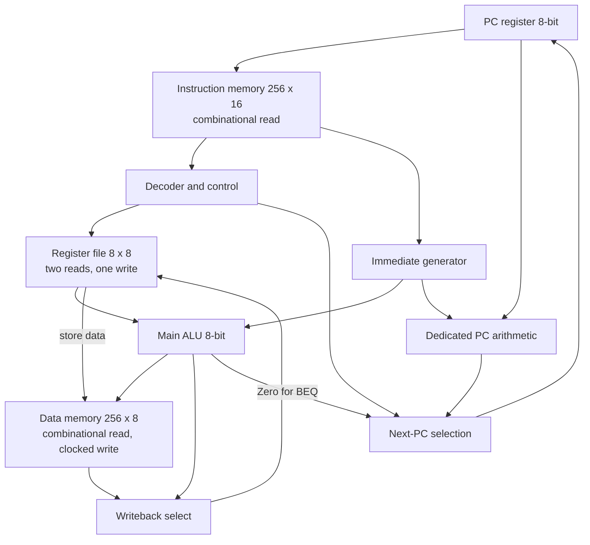

# Architecture Specification v1.0 — Proposed Freeze

**Status: proposed freeze; awaiting explicit user approval.** This is a custom **8-bit RISC-V-inspired processor**, not a standard RISC-V implementation and not RISC-V compliant. This specification records the approved architectural decisions. It does not define RTL or add instructions beyond the twelve listed here.

## A. Final architecture table

| Property | Specification |
|---|---|
| Datapath width | 8 bits |
| Instruction width | 16 bits, fixed length |
| Architectural registers | 8 × 8-bit registers: `x0`–`x7` |
| `x0` | Reads as zero; writes are discarded independently of reset |
| Program counter | 8-bit, word-addressed instruction-memory address |
| Sequential execution | `PC + 1`, modulo 256 |
| Instruction memory | 256 × 16-bit words, combinational read; not reset |
| Data memory | 256 × 8-bit bytes, combinational read and clock-edge write; not reset |
| Data address | 8 bits; effective addresses wrap modulo 256 |
| Execution model | Single-cycle, unpipelined; one instruction completes architecturally per clock cycle |
| Reset | Active-high synchronous; resets PC and `x1`–`x7`; does not reset memories |
| Memory initialization | Instruction image may be loaded from a `.mem` file as supported by simulation/FPGA tools |
| Timing | Clock period must cover the worst-case combinational path; timing closure is evaluated during FPGA implementation |

This is an educational custom architecture inspired by RISC-V concepts. Its register count, datapath width, and instruction encoding are project-specific.

## B. Final instruction encoding table

All formats are 16 bits. Bit 15 is the most significant bit. Each 3-bit register field selects `x0`–`x7`.

### Formats

```text
R: 15:12 opcode | 11:9 rd   | 8:6 rs1  | 5:3 rs2  | 2:0 funct3
I: 15:12 opcode | 11:9 rd   | 8:6 rs1  | 5:0 imm6
S: 15:12 opcode | 11:9 data | 8:6 base | 5:0 imm6
B: 15:12 opcode | 11:9 rs1  | 8:6 rs2  | 5:0 offset6
J: 15:12 opcode | 11:9 rd   | 8:0 offset9
```

`imm6` and `offset6` are signed two's-complement values in the range −32 to +31. `offset9` is signed two's-complement in the range −256 to +255. Branch and jump offsets are in instruction words and relative to `PC+1`.

| Instruction | Opcode | Format / funct3 | Architectural operation |
|---|---:|---|---|
| `ADD rd, rs1, rs2` | `0000` | R / `000` | `rd = low8(rs1 + rs2)` |
| `SUB rd, rs1, rs2` | `0000` | R / `001` | `rd = low8(rs1 - rs2)` |
| `AND rd, rs1, rs2` | `0000` | R / `010` | `rd = rs1 & rs2` |
| `OR rd, rs1, rs2` | `0000` | R / `011` | `rd = rs1 OR rs2` |
| `XOR rd, rs1, rs2` | `0000` | R / `100` | `rd = rs1 XOR rs2` |
| `SLL rd, rs1, rs2` | `0000` | R / `101` | `rd = low8(rs1 << rs2[2:0])` |
| `SRL rd, rs1, rs2` | `0000` | R / `110` | `rd = rs1 >> rs2[2:0]`, logical zero-fill |
| `ADDI rd, rs1, imm` | `0001` | I | `rd = low8(rs1 + sign_extend(imm6))` |
| `LOAD rd, imm(base)` | `0010` | I | `rd = data_mem[low8(base + sign_extend(imm6))]` |
| `STORE data, imm(base)` | `0011` | S | `data_mem[low8(base + sign_extend(imm6))] = data` |
| `BEQ rs1, rs2, offset` | `0100` | B | If equal, `PC = low8(PC+1 + sign_extend(offset6))`; otherwise `PC=PC+1` |
| `JAL rd, offset` | `0101` | J | `rd=PC+1`; `PC=low8(PC+1 + sign_extend(offset9))` |

The seven R-format operations use funct3 values `000` through `110`. R-format funct3 `111` and every unassigned opcode are reserved and illegal.

## C. Final control-signal table

Signal encodings below are internal implementation conventions that make the frozen operations explicit; they do not add ISA features.

| Signal | Meaning / encoding |
|---|---|
| `RegWrite` | Enables synchronous register-file write; writes to `x0` are still discarded |
| `MemWrite` | Enables synchronous data-memory write at the active clock edge |
| `ALUSrc` | `0`: ALU B input is `rs2_data`; `1`: ALU B input is sign-extended `imm6` |
| `ALUControl[2:0]` | `000` ADD, `001` SUB, `010` AND, `011` OR, `100` XOR, `101` SLL, `110` SRL; `111` reserved |
| `ResultSrc[1:0]` | `00` ALU result, `01` data-memory read, `10` `PC_plus_1`; `11` reserved |
| `PCSrc[1:0]` | `00` sequential `PC_plus_1`, `01` branch target when BEQ equality is true (otherwise sequential), `10` jump target; `11` reserved |
| `Zero` | ALU subtraction result is zero; used for BEQ equality |
| `illegal_instr` | Combinationally high for reserved/unsupported instruction encoding |

| Instruction | RegWrite | MemWrite | ALUSrc | ALUControl | ResultSrc | PCSrc |
|---|---:|---:|---:|---|---|---|
| R-format ALU | 1 | 0 | 0 | `funct3` | `00` | `00` |
| ADDI | 1 | 0 | 1 | ADD | `00` | `00` |
| LOAD | 1 | 0 | 1 | ADD | `01` | `00` |
| STORE | 0 | 1 | 1 | ADD | `00` (unused) | `00` |
| BEQ | 0 | 0 | 0 | SUB | `00` (unused) | `01` |
| JAL | 1 | 0 | 0 (unused) | ADD (unused) | `10` | `10` |
| Illegal | 0 | 0 | 0 (safe default) | ADD (safe default) | `00` (safe default) | `00` |

For BEQ, `PCSrc=01` selects the target only when `Zero=1`; otherwise the next PC is sequential. For illegal encodings, unused data-path controls use the stated safe defaults and must not cause architectural state changes.

## D. Final datapath description

The current PC addresses a 16-bit instruction word. The instruction is decoded into register indices, immediates, operation controls, and write enables. The register file supplies two 8-bit read values. The immediate generator sign-extends the relevant offset/immediate. The main 8-bit ALU performs register/immediate arithmetic, logic, shifts, load/store effective-address addition, and subtraction for BEQ equality.

Dedicated combinational PC arithmetic calculates `PC_plus_1`, branch target, and jump target. Next-PC selection chooses sequential, taken-branch, or jump target. Writeback selects ALU result, data-memory read data, or `PC_plus_1` for JAL link. Register and data-memory writes occur at the active clock edge. The PC updates at that edge unless synchronous reset is asserted.



## E. Reset behavior

- Reset is active-high and synchronous to the processor clock.
- On a rising clock edge with reset asserted, PC becomes `8'h00` and `x1`–`x7` become `8'h00`.
- `x0` always reads zero and ignores writes, independently of reset.
- Instruction memory and data memory are not reset by CPU reset.
- During reset, PC/register reset behavior takes priority over normal state updates.

## F. Illegal-instruction behavior

`illegal_instr` is a combinational decode signal for the currently fetched instruction. It is high for R-format funct3 `111` and any unassigned opcode. During that decode cycle, `RegWrite=0` and `MemWrite=0`; no architectural register or data-memory state changes. At the next active clock edge the PC advances normally to `PC+1` (modulo 256). The signal remains high for the decode cycle corresponding to that instruction.

## G. Memory timing

| Memory | Read behavior | Write behavior | Reset / initialization |
|---|---|---|---|
| Instruction memory | Combinational read at current 8-bit PC | No CPU write port specified | Not reset; instruction image may use a `.mem` initialization file |
| Data memory | Combinational read at effective 8-bit address | Synchronous write on active clock edge when `MemWrite=1` | Not reset by CPU reset |

Arrays should be written in a synthesizable style. Version 1 prioritizes functional correctness; block-RAM optimization is deferred. Tool-specific memory initialization and mapping are checked during simulation and FPGA implementation.

## H. PC, branch, jump, and address equations

All architectural PC and data addresses are 8 bits. `low8(x)` means retain the low 8 bits after the specified wider arithmetic.

```text
PC_plus_1    = low8(PC + 1)
branch_target = low8(PC + 1 + sign_extend(offset6))
jump_target   = low8(PC + 1 + sign_extend(offset9))
effective_address = low8(rs1_data + sign_extend(imm6))
```

For branch/jump target calculations, the addition uses sufficient width before truncation. In particular, the 9-bit signed JAL offset is added to the nonnegative 8-bit `PC_plus_1` in at least a 10-bit signed calculation; the result is then reduced to its low 8 bits. `JAL` writes `PC_plus_1` (8-bit architectural value) to `rd`. `BEQ` compares `rs1` and `rs2` by performing subtraction and testing `Zero`. A taken branch/jump target is relative to `PC+1`.

## I. Module interfaces

These are conceptual module contracts, not RTL. Signal names can be adjusted during implementation if widths and behavior remain the same.

| Module | Inputs | Outputs / behavior |
|---|---|---|
| Program counter | `clk`, `reset` (1 bit), `pc_next[7:0]` | `pc[7:0]`; active-high synchronous reset to zero |
| Instruction memory | `address[7:0]` | `instruction[15:0]`; combinational read |
| Instruction decoder/control | `instruction[15:0]` | `rd/rs1/rs2` indices as applicable (3 bits each), `RegWrite`, `MemWrite`, `ALUSrc`, `ALUControl[2:0]`, `ResultSrc[1:0]`, `PCSrc[1:0]`, `illegal_instr` |
| Register file | `clk`, `reset`, `read_addr1[2:0]`, `read_addr2[2:0]`, `write_enable`, `write_addr[2:0]`, `write_data[7:0]` | `rs1_data[7:0]`, `rs2_data[7:0]`; two combinational reads, one synchronous write, x0 hardwired |
| Immediate generator | `instruction[15:0]` | Signed `imm6`/branch offset and signed `offset9` fields for the applicable format |
| ALU | `a[7:0]`, `b[7:0]`, `ALUControl[2:0]` | `result[7:0]`, `Zero`; 8-bit operations listed in this specification |
| Data memory | `clk`, `MemWrite`, `address[7:0]`, `write_data[7:0]` | `read_data[7:0]`; combinational read, synchronous write |
| PC arithmetic | `pc[7:0]`, signed branch offset6, signed jump offset9 | `PC_plus_1[7:0]`, `branch_target[7:0]`, `jump_target[7:0]` |
| Next-PC selection | `PCSrc`, `Zero`, PC arithmetic outputs | `pc_next[7:0]`; BEQ target selected only when equal |
| Writeback selection | `ResultSrc`, ALU result, memory read data, `PC_plus_1` | `write_data[7:0]` |
| CPU top level | `clk`, `reset`; instruction image supplied to instruction memory | Architectural state updates and observable `illegal_instr` |

## J. Verification requirements

Verification proceeds from modules to CPU integration; no module or full CPU is implemented before the architecture receives explicit approval.

1. **ALU:** verify all seven operations; 8-bit wraparound; subtraction and zero detection; logical shifts by 0 and 7; shift amount comes from the low three bits of `rs2`.
2. **Register file:** verify two combinational reads, synchronous writes, reset of `x1`–`x7`, reset independence of `x0`, discarded writes to `x0`, and constant-zero reads from `x0`.
3. **Immediate/decoder/control:** verify each opcode and R funct3, signed `imm6`/branch offsets at −32 and +31, JAL offsets at −256 and +255, and all reserved encodings. Check illegal controls suppress both write enables.
4. **PC arithmetic:** verify sequential increment and wraparound, positive/negative branch offsets, JAL offsets, `PC+1` link value, and low-8-bit target truncation including boundary cases.
5. **Memories:** verify combinational reads, clock-edge data writes, address wraparound, no CPU-reset clearing, and instruction image initialization.
6. **Control/datapath integration:** verify writeback sources (ALU, load, link), effective-address path, taken/not-taken BEQ, JAL, and no state changes for illegal instructions except PC advance.
7. **CPU programs:** run both specified demonstration programs from the instruction image and check all expected registers and memory values, including the loop's branch/jump offsets.
8. **FPGA stage:** after functional simulation, verify synthesis support for the selected array and initialization style and evaluate the worst-case single-cycle timing path. Do not optimize for block RAM in Version 1.

### Demonstration-program expectations

Program 1:

```asm
ADDI x1, x0, 5
ADDI x2, x0, 10
ADD  x3, x1, x2
STORE x3, 20(x0)
LOAD  x4, 20(x0)
```

Expected: `x1=5`, `x2=10`, `x3=15`, `data_mem[20]=15`, `x4=15`.

Program 2:

```asm
ADDI x1, x0, 0
ADDI x2, x0, 1
ADDI x3, x0, 5
LOOP:
ADD  x1, x1, x2
ADDI x3, x3, -1
BEQ  x3, x0, DONE
JAL  x0, LOOP
DONE:
STORE x1, 20(x0)
```

With instructions at consecutive word addresses starting from zero, `BEQ` uses offset `+1` to reach `DONE`, and `JAL` uses offset `−4` to return to `LOOP`. Expected: `data_mem[20]=5`.

---

**Approval gate:** This document is “Architecture Specification v1.0 — Proposed Freeze.” No RTL is authorized until the user explicitly approves this specification.
